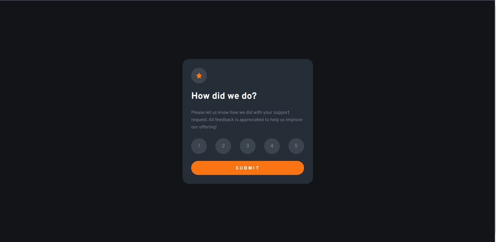

# Frontend Mentor - Interactive rating component solution

This is a solution to the [Interactive rating component challenge on Frontend Mentor](https://www.frontendmentor.io/challenges/interactive-rating-component-koxpeBUmI). Frontend Mentor challenges help you improve your coding skills by building realistic projects. 

## Table of contents

- [Overview](#overview)
  - [The challenge](#the-challenge)
  - [Screenshot](#screenshot)
  - [Links](#links)
- [My process](#my-process)
  - [Built with](#built-with)
- [Author](#author)

## Overview

### The challenge

Users should be able to:

- View the optimal layout for the app depending on their device's screen size (345px and 1440px)
- See hover states for all interactive elements on the page
- Select and submit a number rating
- See the "Thank you" card state after submitting a rating

### Screenshot

!

### Links

- Solution URL:  (https://github.com/ashraf0084/interactive-rating-component-main)
- Live Site URL: (https://glistening-tapioca-bc0e5d.netlify.app/)

## My process

### Built with

- Semantic HTML5 markup
- SASS
- Flexbox
- CSS Grid

## Author

- Author - [Ashraf Shaikh](https://www.your-site.com)

